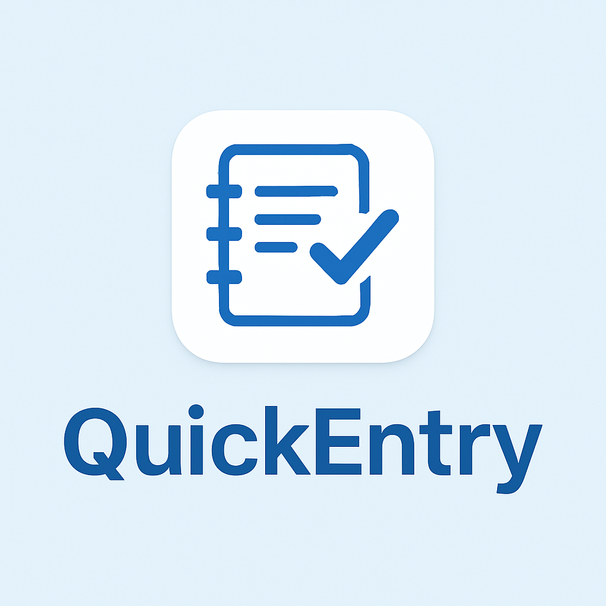

<h1 align="center">Hi 👋, I'm Asifa Hamid Khan</h1>
<h3 align="center"><u>A Passionate Software Engineer</u></h3>

<!-- Animated typing banner -->

  

<!-- Hero GIF (female software engineer) -->

  

<!-- Profile views -->

  

---

### 👩‍💻 About Me
- 🌱 Currently learning **Python** libraries: Pandas, Seaborn, TensorFlow  
- 📚 Exploring **Machine Learning**, **NLP**, and **Data Visualization**  
- 💻 Skills: **HTML, CSS, Python** · Familiar with **JavaScript, C**  
- ⚡ Fun fact: I love turning ideas into clean, working products!

---

### 🧩 Connect with Me

  
  
  

---

### 🛠️ Languages & Tools

  
  
  
  
  
  
  
  
  

---

<h3 align="center">
  
   
  QuickEntry App – Smart Digital Log Register
</h3>

The **QuickEntry App** is a modern and smart digital log register designed to replace traditional manual registers.  
It provides an easy-to-use interface for recording entries with automatic time tracking, dark mode support, and admin features.  

---

## ✨ Features  
- **Auto Time In/Out** → Automatically fills in *Time In* when the app opens and *Time Out* when submitting an entry.  
- **Register-style UI** → Clean table layout with visible grid lines resembling a traditional manual register.  
- **Dark Mode** → Toggle between light and dark themes for a better user experience.  
- **PDF Export** → Print or save all entries in a professional PDF format.  
- **Admin Login** → Accessible via a hidden menu (three dots on the top-left corner).  
- **Splash Screen** → Displays the logo before loading the main interface.  
- **Modern Fonts & Animations** → Stylish fonts with smooth animated transitions for a polished look.  

---

## 🖼️ Layout Overview  
The register layout follows this structure:  

| Name | Date | Time In | Time Out | Reason |  
|------|------|---------|----------|--------|  

---

## 🚀 Future Enhancements  
- Cloud backup of logs  
- Multi-user support  
- Mobile-first optimization  
- Analytics dashboard  

---

## 🔗 Repository  
[QuickEntry App Repo](https://github.com/Asiiifa/quick-entry-app)

---

## 📊 GitHub Stats

  

## 🔥 Streak Stats

  

## 🌟 Top Languages

  

## 🏆 GitHub Trophies

  

## 📈 Contribution Graph 

  

---

<!-- Closing GIF (female coder) -->

  

  <i>✨ “Where Innovation Meets AI-Driven Code” ✨</i>

